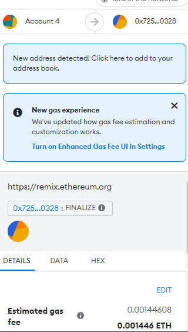

# KaseiCoin
Cryptocurrency KaseiCoin is a fungible token that is ERC-20 compliant

---

## Summary

KaseiCoin is a fungible token that is ERC-20 compliant and that will be minted by using a Crowdsale contract from the OpenZeppelin Solidity library.

The crowdsale contract will manage the entire crowdsale process, allowing users to send ether to the contract and in return receive KAI, or KaseiCoin tokens. This contract will mint the tokens automatically and distribute them to buyers in one transaction.

The code contains a pragma for Solidity version 0.5.5. The code does the following:

* Create the KaseiCoin token contract.
* Create the KaseiCoin crowdsale contract.
* Create the KaseiCoin deployer contract.
* In order to perform a real-world, pre-production test of this crowdsale whis readme file contains a step by step guide to deploy the crowdsale to a local blockchain by using Remix, MetaMask, and Ganache.
* Use OpenZeppelin to extend the functionality of your crowdsale contract by adding time restrictions, refund capabilities, and a cap for the number of tokens that may be created.
* This project uses an IDE [Remix](https://remix-project.org/) to deploy and run transactions in the blockchain

---
## Installation and Usage

```sh
git clone https://github.com/diegoalcocer/kaseicoin.git
cd kaseicoin/
```
Open the smart contract files (`KaseiCoin.sol` and `KaseiCoinCrowdsale.sol`) using [Remix](https://remix.ethereum.org/), build it and deploy it

### 📚 usage

Compile `KaseiCoint.sol` smart contract using compiler version 0.5.5


Compile `KaseiCoinCrowdsale.sol` contract using compiler version 0.5.5


Compile `KaseiCoinCrowdsale.sol` contract with a KaseiCoinCrowdsaleDeployer, using compiler version 0.5.5


Select the Metamask Provider


Deploy the contract (KaseiCoinCrowdSaleDeployer)


Get the `kasei_crowdsale_address` address to link it to the `KaseiCoinCrowdSale` contract


Verify the functionality is now available from the `KaseiCoinCrowdSale`


Get the address of the `kasei_token_address` contract to link it to the mintable token `KaseiCoin`


The KaseiCoin mintable functions are now available


Now you can buy tokens using an address from the blockchain


Set the amount of wei you want to buy 


And setting the address of the wallet that is buying the tokens


Use metamask to confirm


Check the balance of the account that bought the tokens and the total supply of minted tokens


🎥
 Please check the video showing the functionality:
 
* img/RemixEthereumIDE.mp4

Use OpenZeppelin to extend the functionality of the crowdsale contract by adding time restrictions, refund capabilities, and a cap for the number of tokens that may be created


When the goal is reached:


To finalize the sale, isOpen must return false (isOpen comes from TimedCrowdsale and checks to see whether the close time has passed yet).



## License

[](https://www.gnu.org/licenses/gpl-3.0)
